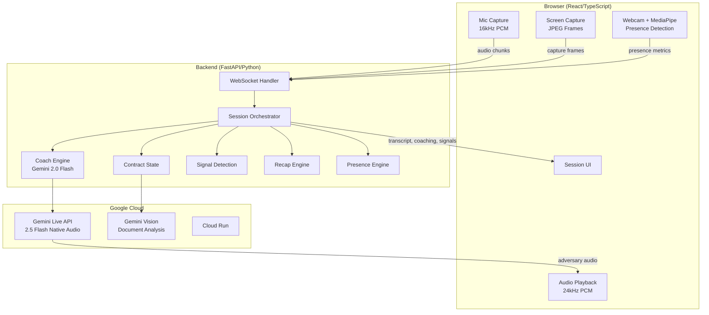
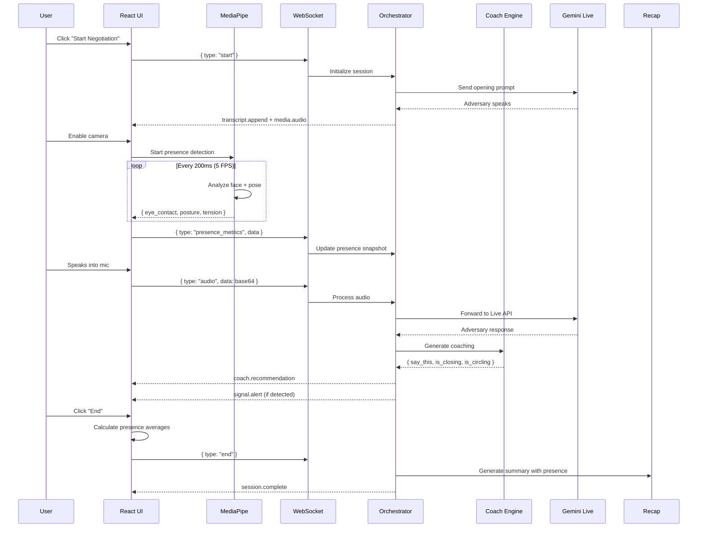
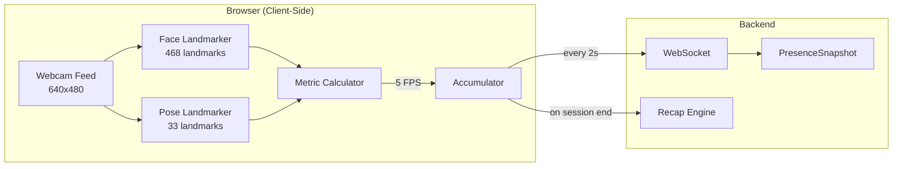
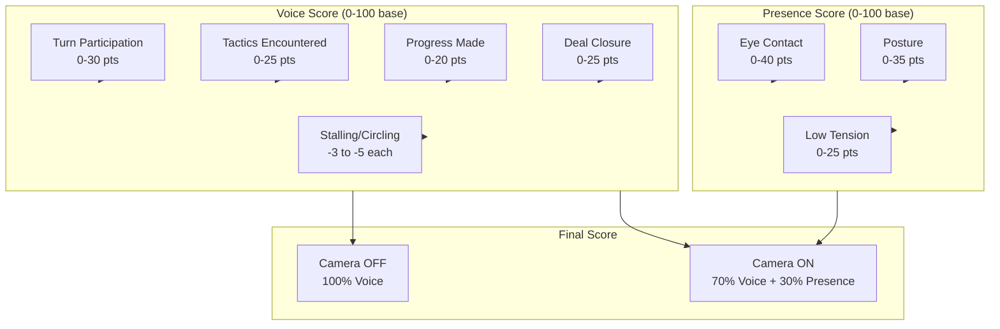
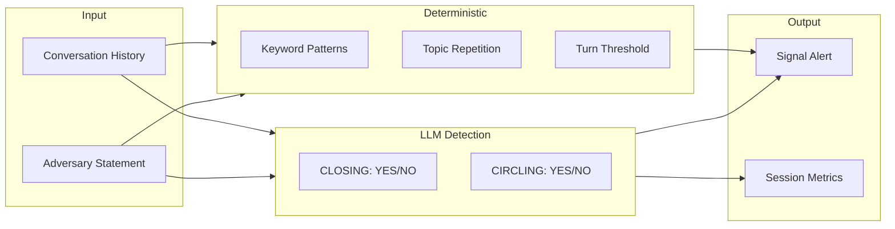
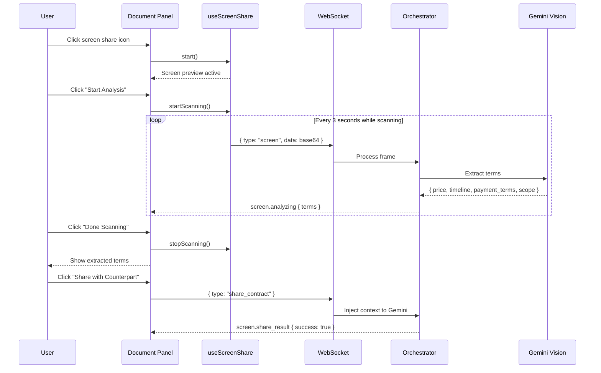
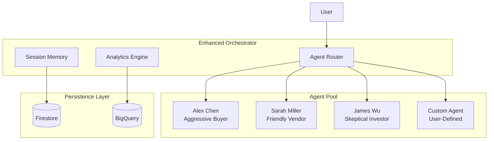
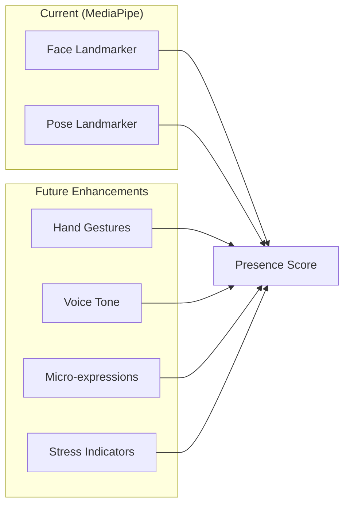

# Secondus — Architecture & System Design

> Secondus is a real-time negotiation copilot. It hears the exchange, sees written terms, detects pressure tactics, analyzes your visual presence, and gives the user the best next line to say.

## Product Overview

Secondus is an AI-powered negotiation practice partner that:
- **Speaks** as a tough counterparty (Alex Chen, TechNova CTO)
- **Listens** to your responses with real-time transcription
- **Sees** shared contract documents via screen capture
- **Watches** your presence via MediaPipe (eye contact, posture, tension)
- **Detects** pressure tactics, contract drift, and deal closure
- **Coaches** you with contextual "Say this now" recommendations

## System Architecture



## Core Flow



## Presence Detection System (MediaPipe)

### Overview

Secondus uses **MediaPipe Tasks Vision** to analyze the user's webcam feed in real-time, extracting:
- **Eye Contact** (0-100): Gaze direction relative to camera
- **Posture** (0-100): Shoulder alignment and head position
- **Tension** (0-100): Facial muscle indicators (brow, jaw, squinting)



### Eye Contact Calculation

Uses iris landmarks (468-477) relative to eye corners:

```
leftIrisPosition = (leftIrisCenter.x - leftOuter.x) / leftEyeWidth
rightIrisPosition = (rightIrisCenter.x - rightInner.x) / rightEyeWidth
avgPosition = (leftIrisPosition + rightIrisPosition) / 2

horizontalDeviation = |avgPosition - 0.5|  // 0 = center, 0.5 = fully away
verticalDeviation = |avgIrisY - noseTip.y| * 2

eyeContact = (100 - horizontalDeviation * 200) * 0.7 + 
             (100 - verticalDeviation * 100) * 0.3
```

### Posture Calculation

Uses pose landmarks for shoulders (11, 12) and nose (0):

```
shoulderTilt = atan2(|leftShoulder.y - rightShoulder.y|, 
                     |leftShoulder.x - rightShoulder.x|) * (180/π)

headOffset = |nose.x - shoulderMidpoint.x|

posture = (100 - shoulderTilt * 5) * 0.6 +
          (100 - headOffset * 200) * 0.4
```

### Tension Calculation

Uses 52 face blendshapes for facial expression analysis:

```
browDown = (browDownLeft + browDownRight) / 2
eyeSquint = (eyeSquintLeft + eyeSquintRight) / 2
jawClench = 1 - jawOpen
smiling = (mouthSmileLeft + mouthSmileRight) / 2
frowning = (mouthFrownLeft + mouthFrownRight) / 2

tensionSignals = browDown * 30 + eyeSquint * 25 + jawClench * 25 + frowning * 20
relaxationBonus = smiling * 30

tension = clamp(tensionSignals - relaxationBonus, 0, 100)
```

### Frontend Implementation

```typescript
// usePresenceDetection.ts
const presence = usePresenceDetection({
  onMetrics: (metrics) => {
    // Accumulate for averaging
    presenceMetricsRef.current.eyeContact.push(metrics.eye_contact);
    presenceMetricsRef.current.posture.push(metrics.posture);
    presenceMetricsRef.current.tension.push(metrics.tension);
    
    // Rate-limited send to backend
    session.send({ type: "presence_metrics", data: metrics });
  },
  fps: 5,
});
```

### Backend Integration

```python
# presence_engine.py
@dataclass
class PresenceSnapshot:
    eye_contact: int | None = None
    posture: int | None = None
    tension: int | None = None
    dominant_emotion: str | None = None
    
    def has_data(self) -> bool:
        return self.eye_contact is not None or self.tension is not None
```

## Scoring System

### Score Calculation Formula

The final session score uses a **weighted composite** based on camera state:



### Detailed Score Breakdown

#### Voice/Negotiation Score (Base 100 Points)

| Component | Points | Calculation |
|-----------|--------|-------------|
| **Turn Participation** | 0-30 | `min(30, userTurns * 10)` |
| **Tactics Encountered** | 0-25 | `min(25, uniqueTactics * 8)` |
| **Progress Made** | 0-20 | `min(20, progressInstances * 10)` |
| **Deal Closure** | 0-25 | `25 if dealClosed else 0` |
| **Stalling Penalty** | -5 each | Per stalling instance |
| **Circling Penalty** | -3 each | Per circling instance |

```python
voice_score = turn_score + tactic_score + progress_score + outcome_score - penalties
voice_score = clamp(voice_score, 0, 100)
```

#### Presence Score (Base 100 Points, Camera Only)

| Component | Points | Calculation |
|-----------|--------|-------------|
| **Eye Contact** | 0-40 | `min(40, avgEyeContact * 0.4)` |
| **Posture** | 0-35 | `min(35, avgPosture * 0.35)` |
| **Low Tension** | 0-25 | `min(25, (100 - avgTension) * 0.25)` |

```python
presence_score = eye_points + posture_points + tension_points
presence_score = clamp(presence_score, 0, 100)
```

#### Final Score Calculation

```python
if camera_enabled and has_visual_data:
    final_score = voice_score * 0.70 + presence_score * 0.30
else:
    final_score = voice_score  # No penalty for missing camera

# Participation gates
if not user_actually_spoke:
    final_score = 0
elif user_participation < 2:
    final_score = min(final_score, 30)
elif user_participation < 4:
    final_score = min(final_score, 60)

# Deal closure bonus
if deal_closed and user_actually_spoke:
    final_score = max(final_score, 75)

final_score = clamp(final_score, 10, 100)
```

### Scoring Example

```
Session Data:
- User turns: 4
- Unique tactics: 3
- Progress instances: 1
- Deal closed: Yes
- Stalling: 0, Circling: 0
- Camera enabled: Yes
- Avg eye contact: 77, Avg posture: 77, Avg tension: 35

Voice Score:
- Turns: min(30, 4 * 10) = 30
- Tactics: min(25, 3 * 8) = 24
- Progress: min(20, 1 * 10) = 10
- Outcome: 25 (deal closed)
- Voice Total: 30 + 24 + 10 + 25 = 89

Presence Score:
- Eye: min(40, 77 * 0.4) = 30.8 → 31
- Posture: min(35, 77 * 0.35) = 26.95 → 27
- Tension: min(25, (100-35) * 0.25) = 16.25 → 16
- Presence Total: 31 + 27 + 16 = 74

Final Score:
- 89 * 0.70 + 74 * 0.30 = 62.3 + 22.2 = 84.5 → 85
- But deal closed + spoke → max(85, 75) = 85

Final: 85/100
```

## Backend Modules

### `session_orchestrator.py`
Central runtime controller for each session.

**Responsibilities:**
- Session lifecycle management
- Turn-taking and state transitions
- WebSocket message routing
- Signal emission and rate limiting
- Transcript accumulation
- Presence metrics tracking

**Key Classes:**
```python
class BuddyRuntimeState:
    accumulated_text: str
    user_history: list[str]
    conversation_history: list[dict]
    stalling_count: int
    progress_signals: int
    last_signal_times: dict[str, float]  # Rate limiting

class BuddySessionOrchestrator:
    async def handle_client_message(msg_type, data)
    async def handle_adversary_event(event)
    async def emit_backend_signals(statement, momentum)
    async def emit_coach_recommendation(phrase, context)
    async def emit_signal_alert(urgency, title, message, signal_type)
```

### `coach_engine.py`
LLM-powered coaching and detection engine.

**Capabilities:**
- Generates contextual "Say this now" recommendations
- **LLM-based deal closure detection** (CLOSING: YES/NO)
- **LLM-based conversation circling detection** (CIRCLING: YES/NO)
- Document term extraction via Gemini Vision
- Presence-aware coaching (factors in user tension/stress)

**Prompt Output Format:**
```
CLOSING: YES/NO
CIRCLING: YES/NO
SAY THIS: [coaching phrase]
```

**Detection Logic:**
| Signal | LLM Detects | Examples |
|--------|-------------|----------|
| CLOSING: YES | Deal agreement, goodbye | "That works", "We'll proceed", "Thanks, goodbye" |
| CLOSING: NO | Questions, objections | "Can we adjust?", "What about...?" |
| CIRCLING: YES | Stuck repeating | "As I said...", same position 3x |
| CIRCLING: NO | Making progress | New numbers, counter-offers |

### `contract_state.py`
Manages structured contract terms extracted from screen captures.

**Extracted Fields:**
- `price` - Dollar amount (normalized: "$75,000" → "75000")
- `payment_terms` - Net terms (normalized: "Net-30 from invoice" → "net30")
- `timeline` - Delivery schedule
- `scope` - Work description
- `revisions` - Revision rounds
- `parties` - Contract parties

**Drift Detection:**
```python
def compare_terms(contract_terms, spoken_terms) -> list[dict]:
    # Returns differences like:
    # { "field": "price", "contract": "$75,000", "spoken": "$50K" }
```

### `recap_engine.py`
Generates session summary with dynamic scoring.

**Scoring Weights:**
| Camera State | Voice Weight | Presence Weight |
|--------------|--------------|-----------------|
| Disabled | 100% | 0% |
| Enabled | 70% | 30% |

**Score Components:**
- Turn participation (0-30 pts)
- Tactics encountered (0-25 pts)
- Progress made (0-20 pts)
- Deal closure (0-25 pts)
- Penalties: stalling, circling (-3 to -5 pts each)

### `presence_engine.py`
Defines presence metrics structure for MediaPipe integration.

```python
@dataclass
class PresenceSnapshot:
    eye_contact: int | None = None
    posture: int | None = None
    tension: int | None = None
    dominant_emotion: str | None = None
    
    def has_data(self) -> bool:
        return self.eye_contact is not None or self.tension is not None
    
    def summary(self) -> dict:
        return {
            "eye_contact": self.eye_contact or 0,
            "posture": self.posture or 0,
            "tension": self.tension or 0,
            "dominant_emotion": self.dominant_emotion or "neutral",
        }
```

### `session_repository.py`
Optional Firestore persistence for completed sessions (Session Memory).

- **When:** After recap is built in `POST /session/buddy/recap`; save runs in a thread (fire-and-forget).
- **Enabled:** If `GOOGLE_CLOUD_PROJECT` is set and `PERSIST_SESSIONS_TO_FIRESTORE` is truthy, or when running on Cloud Run (`K_SERVICE` set).
- **Collection:** `sessions`; each doc stores session payload + `stored_analysis` from `learnings.analyze_session`.
- **Impact:** None on response or demo flow; failures are logged and ignored.

### `learnings.py`
Personalized negotiation intelligence (patterns, recommendations, briefing).

- **Storage:** `data/user_learnings.json` (patterns, session list, recommendations). Completed sessions are also persisted to Firestore via `session_repository` when enabled.
- **Endpoints:** `GET /learnings/briefing`, `POST /learnings/analyze`, `GET /learnings/tip/{tactic}`.
- **Used by:** Recap endpoint calls `analyze_session` then `build_buddy_recap`; briefing/tip used by frontend when available.

### `adversary.py`
AI counterparty agent definition using Google ADK.

**Role:** Alex Chen, CTO of TechNova (fictional startup)

**Behavior:**
- Opens with budget constraint and timeline pressure
- Responds to user naturally, handles interruptions
- Uses negotiation tactics (anchoring, urgency, nibbling)
- Can discuss price, timeline, payment terms, equity, IP

## Signal Detection System

### Hybrid LLM + Deterministic Approach



### Signal Types

| Signal | Urgency | Trigger | Research Basis |
|--------|---------|---------|----------------|
| **Anchoring Pressure** | urgent | "$50K budget", low price anchor | Harvard PON |
| **Timeline Pressure** | watch | "6 weeks", artificial urgency | Chris Voss |
| **Contract Drift** | urgent | Spoken terms ≠ written terms | Fisher & Ury |
| **Goal Mismatch** | watch | Offer differs from target | BATNA theory |
| **Conversation Circling** | note | LLM + turns ≥ 5 | G. Richard Shell |
| **Stalling Detected** | watch | 3+ stalling patterns | Tactical empathy |

### Research Foundation

Coaching recommendations are grounded in established negotiation research:

- **Harvard Program on Negotiation (PON)** — BATNA, anchoring, interest-based bargaining
- **"Getting to Yes" (Fisher & Ury)** — Principled negotiation, separating positions from interests
- **"Never Split the Difference" (Chris Voss)** — Tactical empathy, calibrated questions
- **"Bargaining for Advantage" (G. Richard Shell)** — Leverage, ethical boundaries

### Rate Limiting
Signals are rate-limited to prevent spam:
- Urgent signals: 30s cooldown
- Watch/note signals: 45s cooldown

## Document Scanner Flow



## WebSocket Protocol

### Client → Server Messages

| Type | Payload | Purpose |
|------|---------|---------|
| `start` | — | Begin negotiation |
| `audio` | `{ data: base64 }` | User audio chunk |
| `screen` | `{ data: base64 }` | Screen capture frame |
| `share_contract` | — | Send terms to counterpart |
| `client_barge_in` | — | User interruption |
| `mic_state` | `{ muted: bool }` | Mic toggle |
| `camera_state` | `{ active: bool }` | Camera toggle |
| `presence_metrics` | `{ eye_contact, posture, tension, dominant_emotion }` | MediaPipe metrics |
| `end` | — | End session |

### Server → Client Messages

| Type | Payload | Purpose |
|------|---------|---------|
| `session.state` | `{ state: string }` | State transition |
| `transcript.append` | `{ speaker, content }` | Chat message |
| `coach.recommendation` | `{ phrase, context }` | Coaching |
| `signal.alert` | `{ urgency, title, message }` | Alert |
| `media.audio` | `{ data: base64 }` | Adversary audio |
| `session.deal_closed` | `{ detected_by }` | Deal detected |
| `screen.analyzing` | `{ status, terms }` | Doc analysis |
| `session.complete` | `{ content }` | Session ended |

## Frontend Architecture

### Tech Stack
- **Framework:** React 18 + TypeScript
- **Styling:** Tailwind CSS v4
- **Build:** Vite
- **Icons:** Lucide React
- **ML:** MediaPipe Tasks Vision (Face + Pose Landmarker)

### Component Hierarchy
```
App
├── LandingScreen
│   └── Scenario customization form
├── SessionScreen
│   ├── SessionControls (top bar)
│   ├── Transcript (chat messages)
│   ├── DocumentAnalysis (left panel)
│   ├── WebcamPip (bottom right, with presence metrics overlay)
│   ├── CoachCard (bottom center)
│   └── SignalToast (top right)
└── RecapOverlay
    ├── Score (with breakdown)
    ├── Presence Metrics (eye contact, posture, relaxation bars)
    ├── Outcome, strengths, improvements
    └── Download Report
```

### Key Hooks
- `useSession` - WebSocket management, message routing
- `useAudioCapture` - Mic input, 16kHz resampling
- `useAudioPlayback` - Audio buffering, playback queue
- `useScreenShare` - Screen capture, scanning control
- `useCamera` - Webcam access + presence detection integration
- `usePresenceDetection` - MediaPipe Face + Pose Landmarker, metric calculation

## Deployment

### Local Development
```bash
cd backend
uv venv
source .venv/bin/activate
uv pip install -r requirements.txt
export GOOGLE_CLOUD_PROJECT="your-project-id"
python main.py
```

### Cloud Run Deployment
```bash
./deploy.sh
```

The deploy script:
1. Builds React frontend (`npm run build`)
2. Copies `dist/` to `backend/frontend-dist/`
3. Deploys `backend/` to Cloud Run

## Key Design Decisions

### Session Never Auto-Ends
- LLM detects deal closure → `dealClosed: true` in metrics
- User must click "End" to show recap
- Allows continued conversation after agreement

### Hybrid Detection
- LLM provides semantic understanding
- Deterministic checks provide guardrails
- Both must agree for sensitive signals (circling)

### Manual Document Sharing
- User controls when to capture
- User controls when to share with counterpart
- Prevents repetitive "I see the document" responses

### Camera-Aware Scoring
- No penalty for disabled camera
- Presence contributes 30% only when enabled
- Voice/negotiation always primary (70-100%)

### Client-Side ML (MediaPipe)
- All face/pose analysis runs in browser
- No video sent to server (privacy-preserving)
- Only aggregated metrics sent via WebSocket
- Models loaded from CDN (~8MB total)

## Session Recording Format

Sessions are recorded as JSON for recap and analysis:

```json
{
  "startTime": 1773247771320,
  "exchanges": [
    { "speaker": "adversary", "text": "...", "timestamp": "00:05" },
    { "speaker": "user", "text": "...", "timestamp": "00:21" }
  ],
  "tacticsDetected": [
    { "name": "ANCHORING PRESSURE", "desc": "...", "timestamp": "00:05" }
  ],
  "coachingGiven": [
    { "phrase": "...", "context": "Response to: ...", "timestamp": "00:07" }
  ],
  "metrics": {
    "totalTurns": 8,
    "userTurns": 4,
    "userAudioChunks": 0,
    "stallingInstances": 0,
    "progressInstances": 0,
    "circlingInstances": 0,
    "dealClosed": true
  },
  "cameraEnabled": true,
  "visualPresence": {
    "avgEyeContact": 77,
    "avgPosture": 77,
    "avgTension": 35
  }
}
```

## Future Architecture Enhancements

### Multi-Agent System



### Planned Capabilities

| Capability | Status | Target |
|------------|--------|--------|
| Agent Marketplace | Planned | Phase 1 |
| Multi-Agent Simulations | Planned | Phase 1 |
| Session Persistence | Implemented (optional Firestore) | Phase 2 |
| Progress Tracking | Planned | Phase 2 |
| Calendar Integration | Planned | Phase 3 |
| Team Dashboards | Planned | Phase 3 |
| Mobile Apps | Planned | Phase 5 |
| VR Environment | Planned | Phase 5 |

### Enhanced Presence Detection (Future)



## Google Cloud Services Used

| Service | Purpose | API |
|---------|---------|-----|
| **Cloud Run** | Serverless hosting | `run.googleapis.com` |
| **Cloud Build** | Container builds | `cloudbuild.googleapis.com` |
| **Vertex AI** | Gemini API access | `aiplatform.googleapis.com` |
| **Gemini 2.5 Flash** | Real-time voice (Live API) | Via Vertex AI |
| **Gemini 2.0 Flash** | Vision + coaching | Via Vertex AI |

## Challenge Compliance

Built for the **Gemini Live Agent Challenge** (March 2026).

### Requirements Met

| Requirement | Implementation |
|-------------|----------------|
| Leverage Gemini model | Gemini 2.5 Flash (Live) + 2.0 Flash (Vision) |
| Built with GenAI SDK or ADK | Google ADK for adversary agent |
| Google Cloud service | Cloud Run, Cloud Build, Vertex AI |
| Beyond text box | Proactive real-time coaching |

### Differentiators

1. **Coach, Not Commentator** — Exact phrases to say, not commentary
2. **Hybrid Detection** — LLM + deterministic for reliable signals
3. **Client-Side ML** — MediaPipe runs entirely in browser (privacy)
4. **Fair Scoring** — 70/30 voice/presence, no camera penalty
5. **Research-Backed** — Harvard PON, Chris Voss, Fisher & Ury
