# Secondus — Agent Architecture & System Design

> Your trusted second in high-stakes deals — like the advisor who stands behind you in a duel, knowing your strategy and protecting your interests.

## Table of Contents
1. [System Overview](#system-overview)
2. [Architecture Diagrams](#architecture-diagrams)
3. [Agent Design](#agent-design)
4. [Visual Intelligence Pipeline](#visual-intelligence-pipeline)
5. [Learning System](#learning-system)
6. [Practice Mode](#practice-mode)
7. [API Reference](#api-reference)
8. [Cost Management](#cost-management)
9. [Deployment Architecture](#deployment-architecture)

---

## System Overview

Secondus is a **real-time negotiation intelligence agent** built for the Gemini Live Agent Challenge 2026. It breaks the traditional "text box" paradigm by proactively coaching users during live negotiations.

### Core Capabilities

| Capability | Description | Technology |
|------------|-------------|------------|
| **Drift Detection** | Spots contradictions between spoken and written terms | Gemini Live multimodal |
| **Tactic Recognition** | Identifies manipulation tactics with counters | ADK streaming |
| **Visual Coaching** | Real-time body language feedback | MediaPipe |
| **Personalized Learning** | Tracks patterns, provides research-backed advice | Pattern analysis |
| **Barge-In** | Interrupts conversation at critical moments | ADK bidi-streaming |

---

## Architecture Diagrams

### High-Level System Architecture

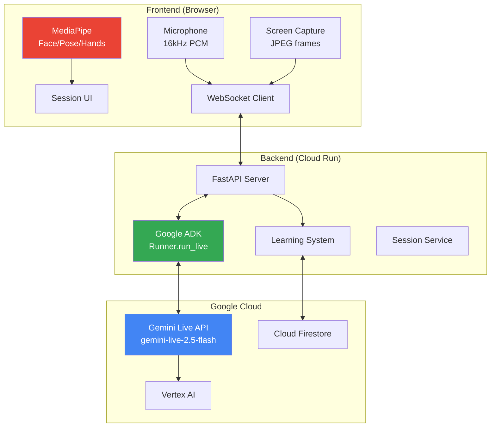

### Component Diagram

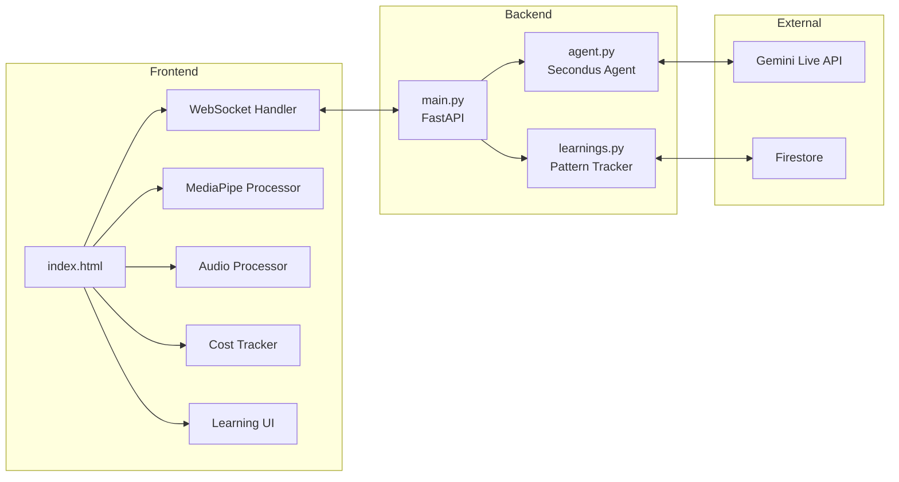

### Data Flow — Practice Session

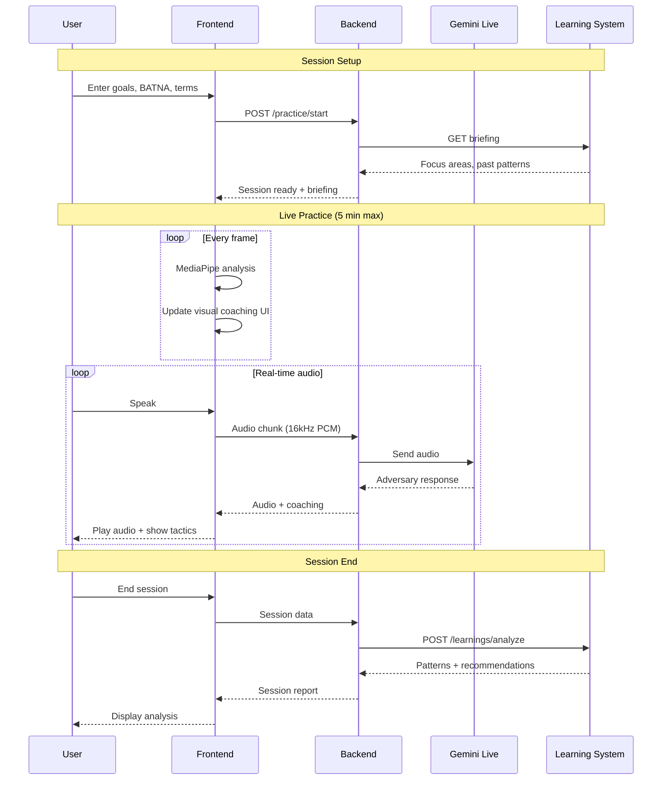

### Real-Time Audio Pipeline

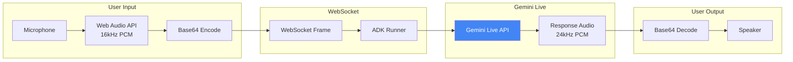

---

## Agent Design

### Core Agent: Secondus

| Property | Value |
|----------|-------|
| **Model** | `gemini-live-2.5-flash-native-audio` |
| **Framework** | Google ADK with bidi-streaming |
| **Mode** | Real-time multimodal (audio + vision) |
| **Session Timeout** | 5 minutes (cost control) |

### Agent State Machine

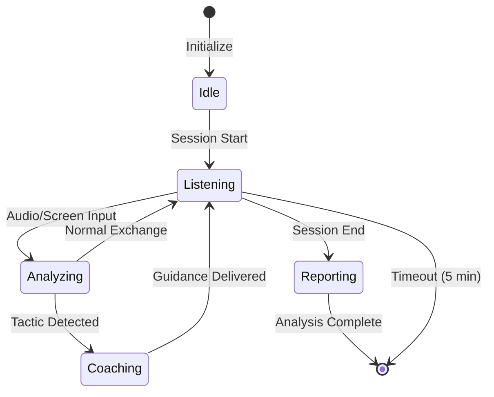

### Input Streams

| Stream | Format | Frequency | Cost |
|--------|--------|-----------|------|
| Audio | 16kHz PCM, base64 | Continuous | ~$0.00025/sec |
| Screen | JPEG frames, base64 | Every 2s | ~$0.001315/image |
| Context | Text (goals, BATNA) | Session start | Minimal |

### Output Format

The agent responds with urgency-coded interventions:

```
SAY THIS: [Exact phrase for user to speak] — Most important!
TACTIC: [Name] - [One-line counter] — For manipulation tactics
DRIFT: [Contract says X, they said Y] — For contradictions
CONFIDENCE: [Voice coaching tip] — For delivery improvement
```

### System Prompt Architecture

```mermaid
flowchart TB
    subgraph SystemPrompt["System Prompt (agent.py)"]
        ROLE[Role Definition<br/>"You are Secondus, a real-time negotiation COACH"]
        CONTEXT[Context Awareness<br/>Audio, Screen, Goals, BATNA]
        TACTICS[Tactic Counters<br/>Anchoring, Urgency, Nibbling...]
        OUTPUT[Output Format<br/>SAY THIS, TACTIC, DRIFT]
        VOICE[Voice Coaching<br/>Pace, Tone, Confidence]
    end

    ROLE --> CONTEXT
    CONTEXT --> TACTICS
    TACTICS --> OUTPUT
    OUTPUT --> VOICE
```

### Tactic Detection Library

| Tactic | Detection Signal | Counter Response |
|--------|------------------|------------------|
| **ANCHORING** | Low first offer | "State YOUR number first" |
| **FLINCHING** | Price surprise reaction | "Silence for 3 seconds, then explain ROI" |
| **NIBBLING** | Extra asks after agreement | "That's outside scope. I can add for $X" |
| **LIMITED AUTHORITY** | "Need to check with boss" | "Let's get them on a call" |
| **URGENCY** | Artificial deadlines | "If timing is critical, let's lock terms now" |
| **CIRCLING** | Same topic repeated | "What's the real concern here?" |

---

## Visual Intelligence Pipeline

### MediaPipe Integration

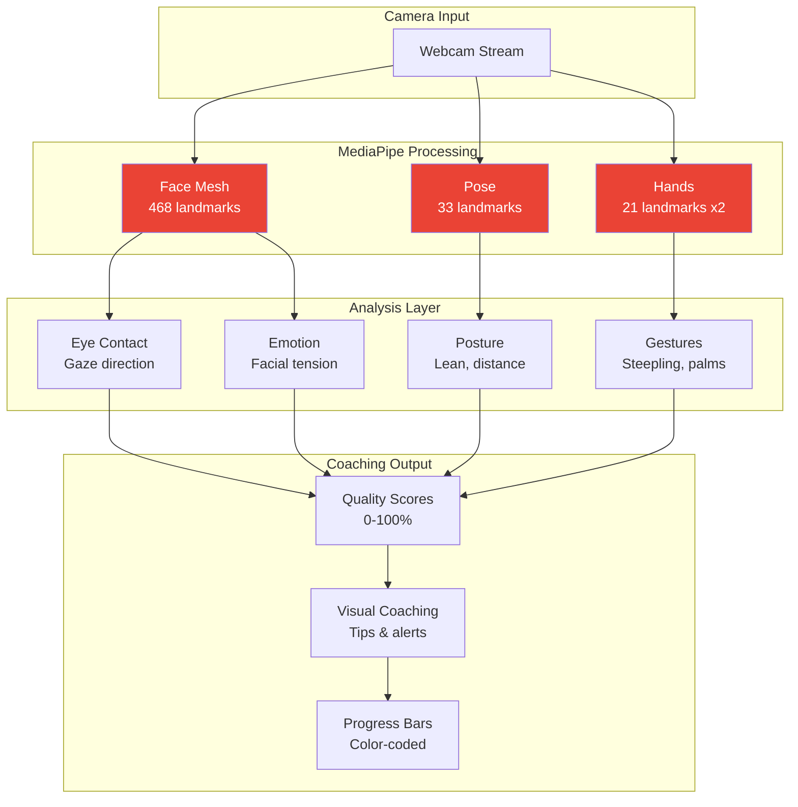

### Landmark Detection

| Model | Landmarks | What We Detect |
|-------|-----------|----------------|
| **Face Mesh** | 468 points | Eye contact, facial tension, head tilt |
| **Pose** | 33 points | Forward/back lean, shoulder width, framing |
| **Hands** | 21 x 2 points | Steepling, open palms, face touching |

### Gesture Detection (Research-Based)

Based on Joe Navarro's body language principles:

| Gesture | MediaPipe Detection | Score Impact |
|---------|---------------------|--------------|
| **Steepling** | Fingertips within 30px, hands above waist | +25 points |
| **Open Palms** | Palm angle facing camera | +15 points |
| **Face Touching** | Hand landmarks near face landmarks | -20 points |

### Visual Coaching UI

```
┌─────────────────────────────────────┐
│ VISUAL COACH              😐 neutral │
│ ┌─────────────────────────────────┐ │
│ │    [Webcam + Face/Hand Mesh]    │ │
│ └─────────────────────────────────┘ │
│ Eye Contact [████████░░] 80%        │  ← Green (70%+)
│ Posture     [██████░░░░] 60%        │  ← Yellow (40-70%)
│ Gestures    [███░░░░░░░] 30%        │  ← Red (<40%)
│ ✋ Open palms — signals honesty      │
│                                     │
│ Est. Cost: $0.42 | Time: 3:24/5:00  │
└─────────────────────────────────────┘
```

**Color Coding:**
- 🟢 Green (70%+): Excellent
- 🟡 Yellow (40-70%): Needs attention
- 🔴 Red (<40%): Needs improvement

---

## Learning System

### Pattern Tracking Architecture

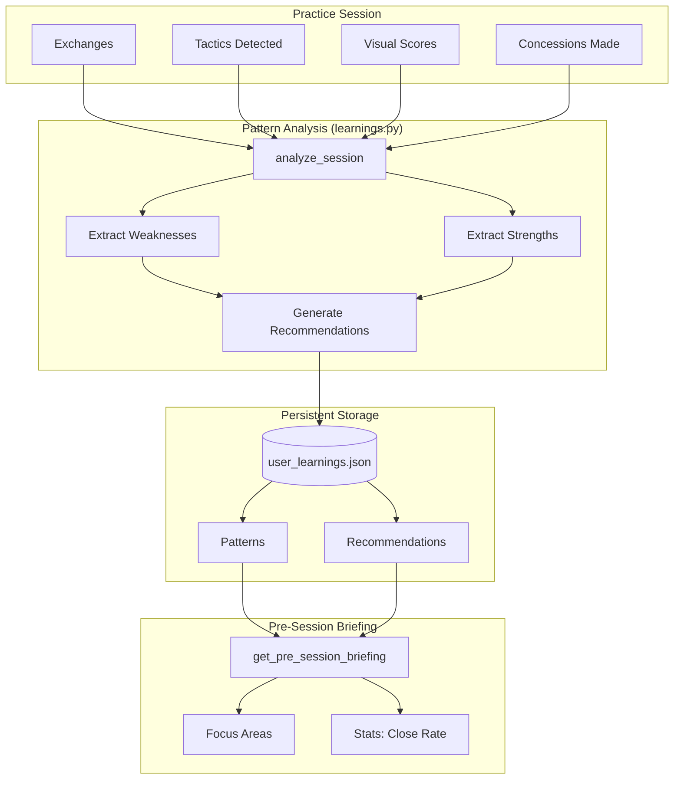

### Tracked Patterns

**Weaknesses (Auto-Detected):**

| Pattern | Detection Trigger | Recommendation |
|---------|-------------------|----------------|
| `STALLING_TOLERANCE` | >5 stall instances | Set time limits early |
| `GAVE_EQUITY` | Equity mentioned in concessions | Demand extended commitment |
| `PAYMENT_TERMS_WEAKNESS` | Net-90 accepted | Counter with discount offer |
| `LOW_EYE_CONTACT` | <40% average eye contact | Look at camera lens |
| `NIBBLING_VULNERABILITY` | 3+ nibble tactics faced | "That's outside scope" |
| `ALLOWED_CIRCLING` | 3+ topic repetitions | Call out directly |

**Strengths (Auto-Detected):**

| Pattern | Detection Trigger |
|---------|-------------------|
| `HELD_PRICE` | No price drops in exchanges |
| `CLOSED_DEAL` | Deal marked as closed |
| `STRONG_EYE_CONTACT` | >70% average eye contact |

### Research-Backed Recommendations

| Source | Applied To |
|--------|------------|
| **Harvard PON** | Time pressure, BATNA usage |
| **Chris Voss** | Trading concessions, labeling |
| **Joe Navarro** | Body language, eye contact |

### Recommendation Engine

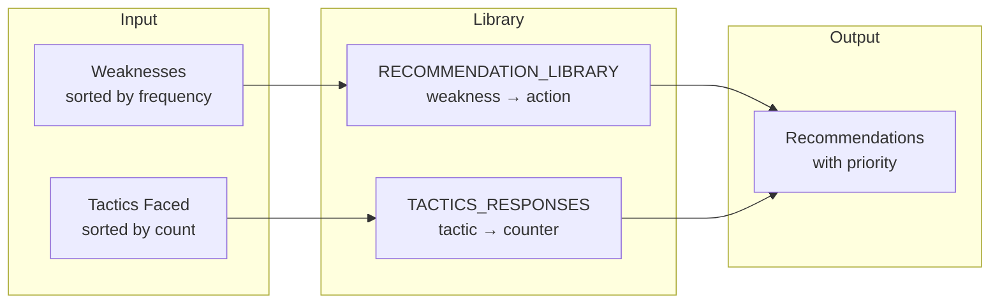

---

## Practice Mode

### Adversary Agent

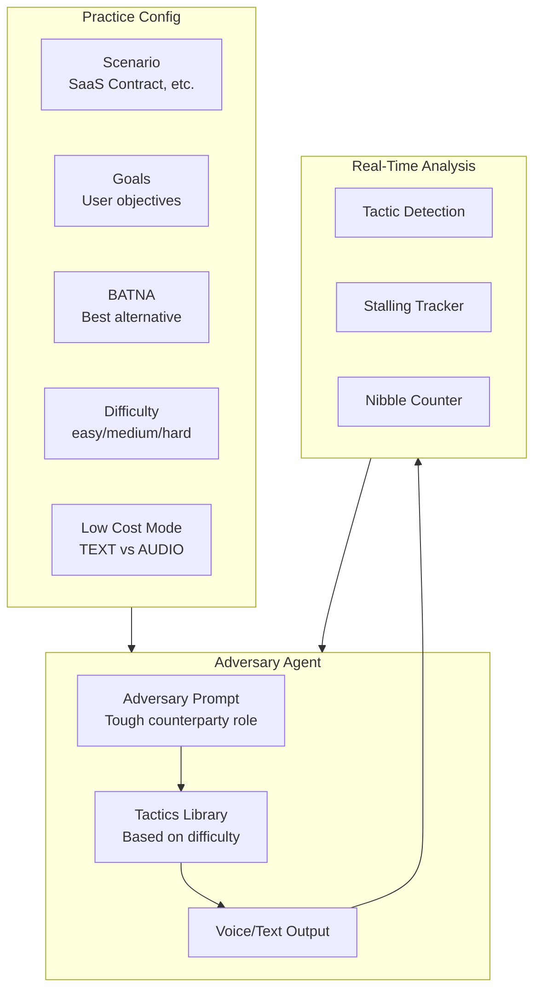

### Difficulty Levels

| Level | Tactics Used | Frequency |
|-------|--------------|-----------|
| **Easy** | Anchoring, Flinching | Occasional |
| **Medium** | + Nibbling, Urgency | Regular |
| **Hard** | + Limited Authority, Circling, Good Cop/Bad Cop | Aggressive |

### Session Flow

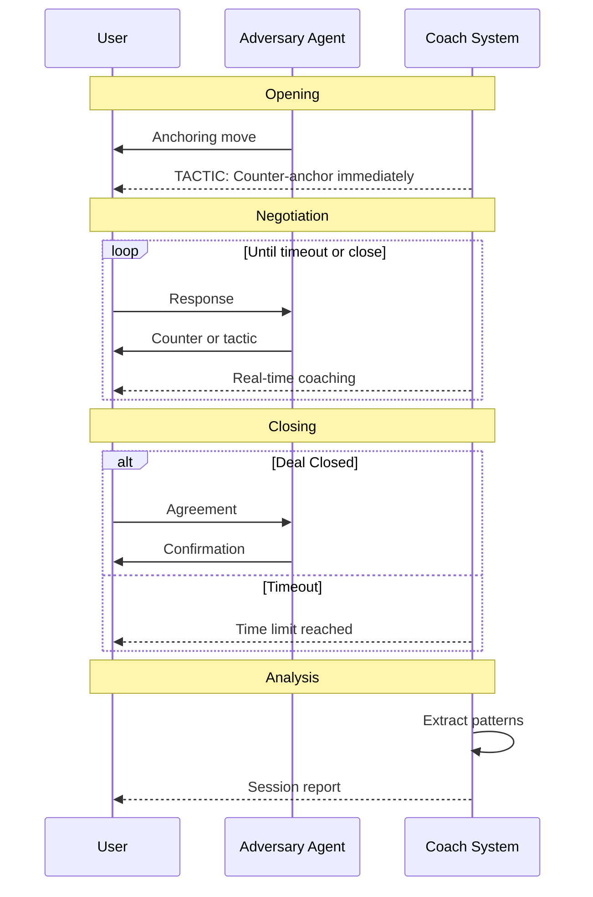

---

## API Reference

### REST Endpoints

| Endpoint | Method | Description |
|----------|--------|-------------|
| `/health` | GET | Health check with model status |
| `/learnings/briefing` | GET | Pre-session personalized briefing |
| `/learnings/analyze` | POST | Analyze session and extract patterns |
| `/learnings/tip/{tactic}` | GET | Quick counter-tip for a tactic |

### WebSocket Endpoints

| Endpoint | Purpose | Message Format |
|----------|---------|----------------|
| `/ws/negotiate` | Live negotiation session | `{type, data, sessionId}` |
| `/ws/practice` | Practice with AI adversary | `{type, audio, config}` |

### WebSocket Message Types

**Client → Server:**
```json
{
  "type": "audio_chunk",
  "data": "<base64 PCM 16kHz>",
  "sessionId": "uuid"
}

{
  "type": "screen_capture",
  "data": "<base64 JPEG>",
  "sessionId": "uuid"
}

{
  "type": "end_session",
  "data": {
    "metrics": {...},
    "exchanges": [...],
    "tacticsDetected": [...],
    "visualPresence": {...}
  }
}
```

**Server → Client:**
```json
{
  "type": "intervention",
  "urgency": "URGENT|WATCH|NOTE",
  "text": "SAY THIS: ..."
}

{
  "type": "audio_response",
  "audio": "<base64 PCM 24kHz>"
}

{
  "type": "session_analysis",
  "patterns": {...},
  "recommendations": [...]
}

{
  "type": "timeout_warning",
  "remaining_seconds": 60
}
```

---

## Cost Management

### API Pricing Model

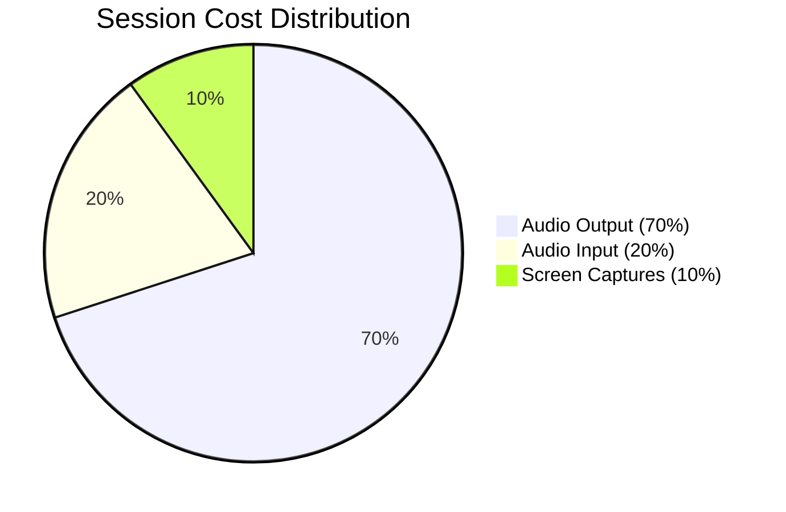

### Rate Structure

| Resource | Rate | Per Session (5 min) |
|----------|------|---------------------|
| Audio Input | $0.00025/sec | ~$0.075 |
| Audio Output | $0.001/sec | ~$0.30 |
| Screen Captures | $0.001315/image | ~$0.20 (150 images) |
| **Total Estimate** | | **~$0.58/session** |

### Cost Control Features

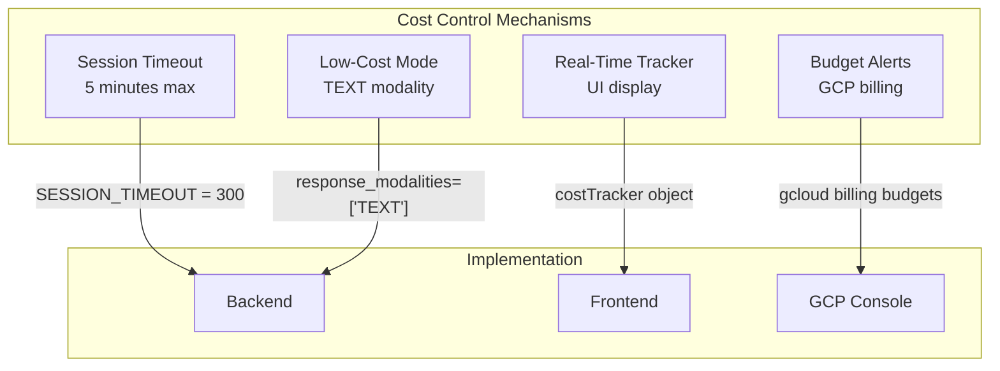

### Low-Cost Mode

When enabled:
- Uses `TEXT` modality instead of `AUDIO`
- Reduces output costs by ~70%
- Still provides real-time coaching via text

### Budget Alert Setup

```bash
gcloud billing budgets create \
  --billing-account=BILLING_ACCOUNT_ID \
  --display-name="Secondus Budget Alert" \
  --budget-amount=50USD \
  --threshold-rule=percent=0.50,basis=current-spend \
  --threshold-rule=percent=0.90,basis=current-spend \
  --threshold-rule=percent=1.00,basis=current-spend
```

---

## Deployment Architecture

### Cloud Run Deployment

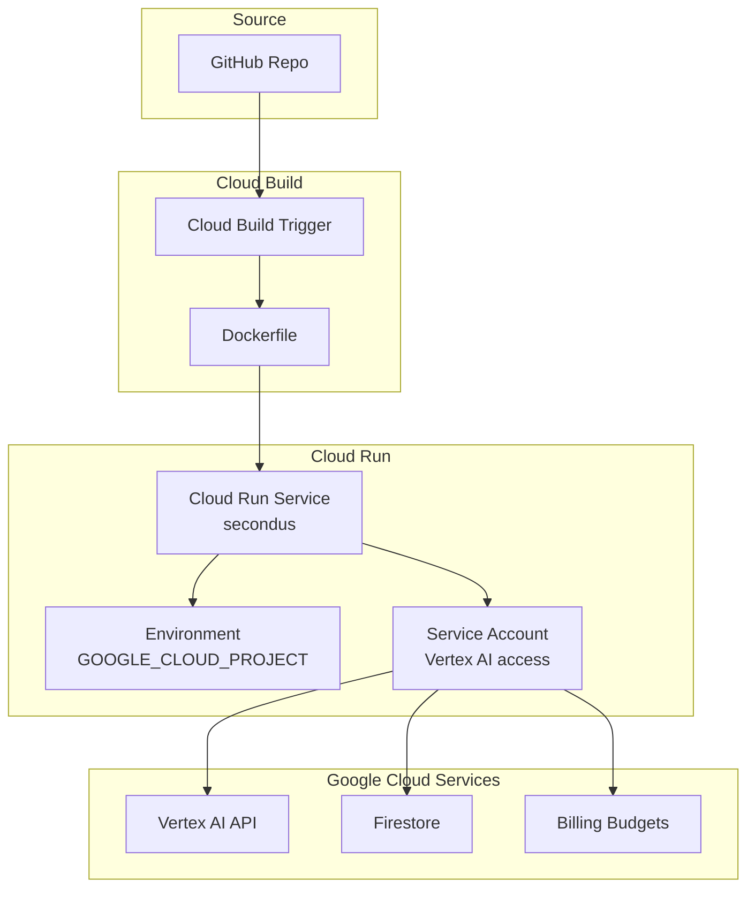

### Deployment Script (deploy.sh)

```bash
#!/bin/bash
gcloud run deploy secondus \
  --source=./backend \
  --region=us-central1 \
  --allow-unauthenticated \
  --set-env-vars="GOOGLE_CLOUD_PROJECT=$PROJECT_ID" \
  --memory=1Gi \
  --timeout=300
```

### Environment Variables

| Variable | Purpose |
|----------|---------|
| `GOOGLE_CLOUD_PROJECT` | GCP project ID |
| `PORT` | Server port (default: 8080) |

### Required APIs

```bash
gcloud services enable \
  aiplatform.googleapis.com \
  run.googleapis.com \
  firestore.googleapis.com \
  billingbudgets.googleapis.com
```

---

## Development Guide

### Local Setup

```bash
cd backend
python -m venv venv
source venv/bin/activate
pip install -r requirements.txt
export GOOGLE_CLOUD_PROJECT="your-project-id"
gcloud auth application-default login
python main.py
```

### Testing

```bash
cd backend
pytest tests/ -v
```

### Adding New Capabilities

1. Update system prompt in `backend/agent.py`
2. Add UI handling in `frontend/index.html`
3. Update pattern tracking in `backend/learnings.py`
4. Add tests in `backend/tests/`
5. Update this documentation

### Debugging

| Component | Debug Method |
|-----------|--------------|
| Frontend | Browser console, MediaPipe overlay |
| WebSocket | Network tab, message logging |
| Backend | FastAPI logs, `/health` endpoint |
| ADK | Session service inspection |
| Gemini | Vertex AI console, usage metrics |

---

## Future Roadmap

### Planned Features

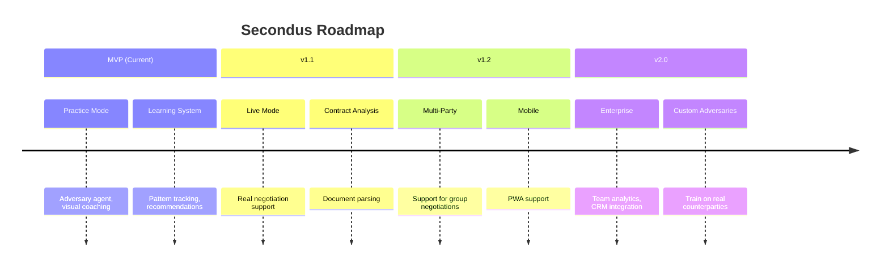

### Contract Comparator (Planned)

Compare final agreed terms against:
- Original document
- Industry benchmarks
- Previous deals

---

## References

### Official Hackathon Resources

- [ADK Bidi-Streaming Development Guide](https://google.github.io/adk-docs/streaming/dev-guide/part1/) — Core implementation patterns
- [ADK Bidi-Streaming Demo](https://github.com/google/adk-samples/tree/main/python/agents/bidi-demo) — Reference architecture
- [ADK Visual Guide (Medium)](https://medium.com/google-cloud/adk-bidi-streaming-a-visual-guide-to-real-time-multimodal-ai-agent-development-62dd08c81399) — Agent lifecycle
- [ADK Bidi-Streaming in 5 Minutes (YouTube)](https://www.youtube.com/watch?v=vLUkAGeLR1k) — Quick overview
- [Live API Notebooks](https://github.com/GoogleCloudPlatform/generative-ai/tree/main/gemini/multimodal-live-api) — Multimodal patterns
- [Live Bidirectional Streaming Agent Codelab](https://codelabs.developers.google.com/way-back-home-level-3/instructions#0) — Step-by-step tutorial
- [Google Developer Community](https://developers.google.com/community) — GDG network

### Negotiation Research

- [Harvard Program on Negotiation](https://www.pon.harvard.edu/) — Time pressure, BATNA
- [Never Split the Difference — Chris Voss](https://www.blackswanltd.com/) — Tactical empathy, labeling
- [What Every BODY is Saying — Joe Navarro](https://www.jnforensics.com/) — Body language signals

### Technical Documentation

- [Google ADK Documentation](https://cloud.google.com/vertex-ai/docs/generative-ai/agent-builder/adk)
- [MediaPipe Documentation](https://developers.google.com/mediapipe)
- [Gemini Live API](https://cloud.google.com/vertex-ai/generative-ai/docs/model-reference/multimodal-live)

---

Built for [Gemini Live Agent Challenge 2026](https://geminiliveagentchallenge.devpost.com)

`#GeminiLiveAgentChallenge`
