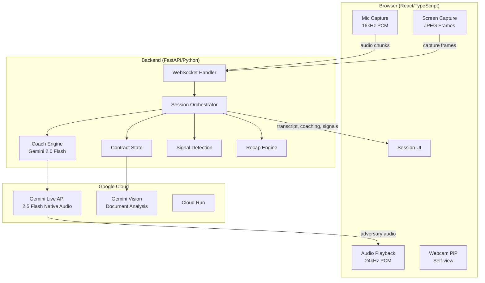
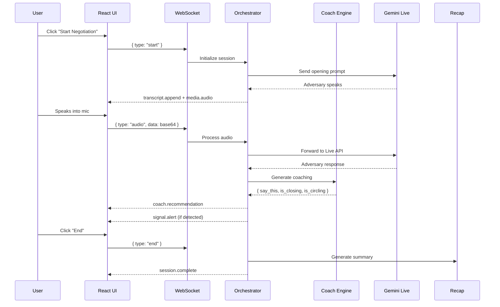
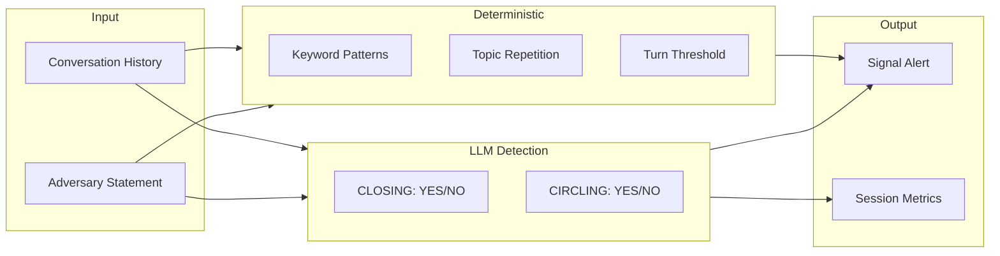
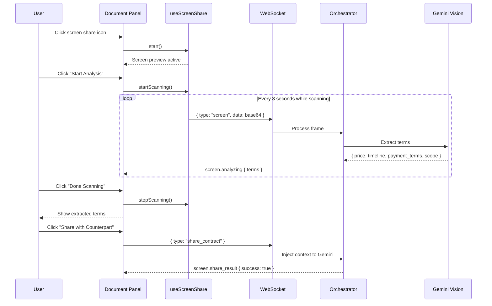

# Secondus — Architecture & System Design

> Secondus is a real-time negotiation copilot. It hears the exchange, sees written terms, detects pressure tactics, and gives the user the best next line to say.

## Product Overview

Secondus is an AI-powered negotiation practice partner that:
- **Speaks** as a tough counterparty (Alex Chen, TechNova CTO)
- **Listens** to your responses with real-time transcription
- **Sees** shared contract documents via screen capture
- **Detects** pressure tactics, contract drift, and deal closure
- **Coaches** you with contextual "Say this now" recommendations

## System Architecture



## Core Flow



## Backend Modules

### `session_orchestrator.py`
Central runtime controller for each session.

**Responsibilities:**
- Session lifecycle management
- Turn-taking and state transitions
- WebSocket message routing
- Signal emission and rate limiting
- Transcript accumulation

**Key Classes:**
```python
class BuddyRuntimeState:
    accumulated_text: str
    user_history: list[str]
    conversation_history: list[dict]
    stalling_count: int
    progress_signals: int
    last_signal_times: dict[str, float]  # Rate limiting

class BuddySessionOrchestrator:
    async def handle_client_message(msg_type, data)
    async def handle_adversary_event(event)
    async def emit_backend_signals(statement, momentum)
    async def emit_coach_recommendation(phrase, context)
    async def emit_signal_alert(urgency, title, message, signal_type)
```

### `coach_engine.py`
LLM-powered coaching and detection engine.

**Capabilities:**
- Generates contextual "Say this now" recommendations
- **LLM-based deal closure detection** (CLOSING: YES/NO)
- **LLM-based conversation circling detection** (CIRCLING: YES/NO)
- Document term extraction via Gemini Vision

**Prompt Output Format:**
```
CLOSING: YES/NO
CIRCLING: YES/NO
SAY THIS: [coaching phrase]
```

**Detection Logic:**
| Signal | LLM Detects | Examples |
|--------|-------------|----------|
| CLOSING: YES | Deal agreement, goodbye | "That works", "We'll proceed", "Thanks, goodbye" |
| CLOSING: NO | Questions, objections | "Can we adjust?", "What about...?" |
| CIRCLING: YES | Stuck repeating | "As I said...", same position 3x |
| CIRCLING: NO | Making progress | New numbers, counter-offers |

### `contract_state.py`
Manages structured contract terms extracted from screen captures.

**Extracted Fields:**
- `price` - Dollar amount (normalized: "$75,000" → "75000")
- `payment_terms` - Net terms (normalized: "Net-30 from invoice" → "net30")
- `timeline` - Delivery schedule
- `scope` - Work description
- `revisions` - Revision rounds
- `parties` - Contract parties

**Drift Detection:**
```python
def compare_terms(contract_terms, spoken_terms) -> list[dict]:
    # Returns differences like:
    # { "field": "price", "contract": "$75,000", "spoken": "$50K" }
```

### `recap_engine.py`
Generates session summary with dynamic scoring.

**Scoring Weights:**
| Camera State | Voice Weight | Presence Weight |
|--------------|--------------|-----------------|
| Disabled | 100% | 0% |
| Enabled | 70% | 30% |

**Score Components:**
- Turn participation (0-30 pts)
- Tactics encountered (0-25 pts)
- Progress made (0-20 pts)
- Deal closure (0-25 pts)
- Penalties: stalling, circling (-3 to -5 pts each)

### `presence_engine.py`
Defines presence metrics structure (future MediaPipe integration).

```python
class PresenceSnapshot:
    eye_contact: int | None
    posture: int | None
    tension: int | None
    
    def has_data(self) -> bool:
        return any([self.eye_contact, self.posture, self.tension])
```

### `adversary.py`
AI counterparty agent definition using Google ADK.

**Role:** Alex Chen, CTO of TechNova (fictional startup)

**Behavior:**
- Opens with budget constraint and timeline pressure
- Responds to user naturally, handles interruptions
- Uses negotiation tactics (anchoring, urgency, nibbling)
- Can discuss price, timeline, payment terms, equity, IP

## Signal Detection System

### Hybrid LLM + Deterministic Approach



### Signal Types

| Signal | Urgency | Trigger |
|--------|---------|---------|
| **Anchoring Pressure** | urgent | "$50K budget", low price anchor |
| **Timeline Pressure** | watch | "6 weeks", artificial urgency |
| **Contract Drift** | urgent | Spoken terms ≠ written terms |
| **Goal Mismatch** | watch | Offer differs from target |
| **Conversation Circling** | note | LLM + turns ≥ 5 |
| **Stalling Detected** | watch | 3+ stalling patterns |

### Rate Limiting
Signals are rate-limited to prevent spam:
- Urgent signals: 30s cooldown
- Watch/note signals: 45s cooldown

## Document Scanner Flow



## WebSocket Protocol

### Client → Server Messages

| Type | Payload | Purpose |
|------|---------|---------|
| `start` | — | Begin negotiation |
| `audio` | `{ data: base64 }` | User audio chunk |
| `screen` | `{ data: base64 }` | Screen capture frame |
| `share_contract` | — | Send terms to counterpart |
| `client_barge_in` | — | User interruption |
| `mic_state` | `{ muted: bool }` | Mic toggle |
| `camera_state` | `{ active: bool }` | Camera toggle |
| `end` | — | End session |

### Server → Client Messages

| Type | Payload | Purpose |
|------|---------|---------|
| `session.state` | `{ state: string }` | State transition |
| `transcript.append` | `{ speaker, content }` | Chat message |
| `coach.recommendation` | `{ phrase, context }` | Coaching |
| `signal.alert` | `{ urgency, title, message }` | Alert |
| `media.audio` | `{ data: base64 }` | Adversary audio |
| `session.deal_closed` | `{ detected_by }` | Deal detected |
| `screen.analyzing` | `{ status, terms }` | Doc analysis |
| `session.complete` | `{ content }` | Session ended |

## Frontend Architecture

### Tech Stack
- **Framework:** React 18 + TypeScript
- **Styling:** Tailwind CSS v4
- **Build:** Vite
- **Icons:** Lucide React

### Component Hierarchy
```
App
├── LandingScreen
│   └── Scenario customization form
├── SessionScreen
│   ├── SessionControls (top bar)
│   ├── Transcript (chat messages)
│   ├── DocumentAnalysis (left panel)
│   ├── WebcamPip (bottom right)
│   ├── CoachCard (bottom center)
│   └── SignalToast (top right)
└── RecapOverlay
    └── Score, outcome, strengths, improvements
```

### Key Hooks
- `useSession` - WebSocket management, message routing
- `useAudioCapture` - Mic input, 16kHz resampling
- `useAudioPlayback` - Audio buffering, playback queue
- `useScreenShare` - Screen capture, scanning control
- `useCamera` - Webcam access

## Deployment

### Local Development
```bash
cd backend
uv venv
source .venv/bin/activate
uv pip install -r requirements.txt
export GOOGLE_CLOUD_PROJECT="your-project-id"
python main.py
```

### Cloud Run Deployment
```bash
./deploy.sh
```

The deploy script:
1. Builds React frontend (`npm run build`)
2. Copies `dist/` to `backend/frontend-dist/`
3. Deploys `backend/` to Cloud Run

## Key Design Decisions

### Session Never Auto-Ends
- LLM detects deal closure → `dealClosed: true` in metrics
- User must click "End" to show recap
- Allows continued conversation after agreement

### Hybrid Detection
- LLM provides semantic understanding
- Deterministic checks provide guardrails
- Both must agree for sensitive signals (circling)

### Manual Document Sharing
- User controls when to capture
- User controls when to share with counterpart
- Prevents repetitive "I see the document" responses

### Camera-Aware Scoring
- No penalty for disabled camera
- Presence contributes 30% only when enabled
- Voice/negotiation always primary (70-100%)

## Session Recording Format

Sessions are recorded as JSON for recap and analysis:

```json
{
  "startTime": 1773192655328,
  "exchanges": [
    { "speaker": "adversary", "text": "...", "timestamp": "00:05" },
    { "speaker": "user", "text": "...", "timestamp": "00:21" }
  ],
  "tacticsDetected": [
    { "name": "ANCHORING PRESSURE", "desc": "...", "timestamp": "00:05" }
  ],
  "coachingGiven": [
    { "phrase": "...", "context": "Response to: ...", "timestamp": "00:07" }
  ],
  "metrics": {
    "totalTurns": 15,
    "userTurns": 12,
    "userAudioChunks": 0,
    "stallingInstances": 0,
    "progressInstances": 0,
    "circlingInstances": 0,
    "dealClosed": true
  },
  "cameraEnabled": false
}
```
