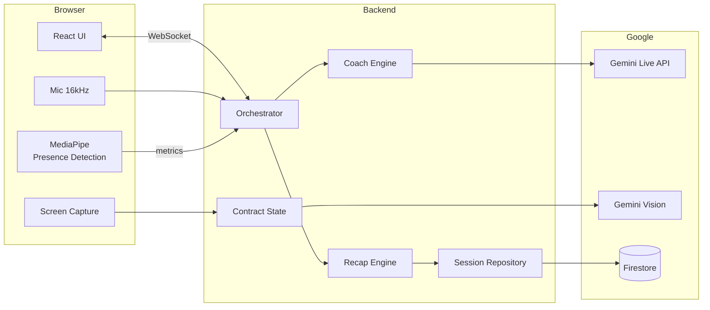
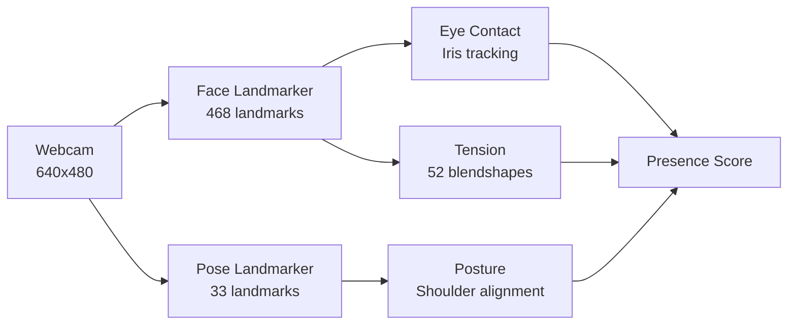

# Secondus

**Real-Time Negotiation Intelligence Agent**

> Your trusted second in high-stakes deals — like the advisor who stands behind you, knowing your strategy and protecting your interests.

[]()
[]()
[]()
[]()
[]()
[](LICENSE)

## The Problem

In negotiations, you're on your own. Skilled counterparties use tactics like anchoring, artificial urgency, and nibbling to extract concessions. By the time you realize what happened, the deal is signed.

## The Solution

Secondus is a **real-time negotiation copilot** that:

| Capability | What It Does |
|------------|--------------|
| **Real-Time Coaching** | "Say this now" recommendations in context |
| **Contract Drift Detection** | Catches when spoken terms differ from written |
| **Tactic Detection** | Identifies anchoring, timeline pressure, etc. |
| **Presence Analysis** | MediaPipe tracks eye contact, posture, tension |
| **LLM-Powered Detection** | Semantic understanding of deal closure and circling |
| **Dynamic Scoring** | Fair 70/30 voice/presence weighting with camera |

## Demo

```
┌─────────────────────────────────────────────────────────────┐
│  THEM: "We have a $50K budget and need this in 6 weeks."    │
│  ───────────────────────────────────────────────────────────│
│  ⚠️ ANCHORING PRESSURE                                      │
│  They set a low price anchor. Re-anchor on value.           │
│  ───────────────────────────────────────────────────────────│
│  💬 SAY THIS NOW                                             │
│  "Thanks for sharing. Our engagements typically start at    │
│   $80K to ensure comprehensive results."                    │
│  ───────────────────────────────────────────────────────────│
│  👁 Eye Contact: 77  |  🧍 Posture: 77  |  😌 Relaxed: 65    │
└─────────────────────────────────────────────────────────────┘
```

## Architecture



See [AGENTS.md](AGENTS.md) for detailed architecture documentation.

## Key Features

### 1. Real-Time Presence Detection (MediaPipe)

Secondus uses **MediaPipe Tasks Vision** running entirely in the browser:



| Metric | How It's Calculated |
|--------|---------------------|
| **Eye Contact** | Iris position relative to eye corners (gaze direction) |
| **Posture** | Shoulder tilt + head alignment |
| **Tension** | Brow furrow + jaw clench + squinting - smiling |

**Privacy-First:** All analysis runs client-side. No video leaves your browser.

### 2. LLM-Powered Detection

The coaching engine returns structured signals:

```
CLOSING: YES/NO  - Is this a deal closure?
CIRCLING: YES/NO - Is conversation stuck?
SAY THIS: [phrase]
```

### 3. Contract Drift Detection

Visual + audio comparison:

```
📋 Contract says: $75,000, Net-30
🎤 They said: "$50K budget, Net-60"
⚠️ DRIFT: Payment terms conflict
```

### 4. Document Scanner

Manual capture and share flow:

1. **Start screen share** → Preview active
2. **Click "Start Analysis"** → Agent scans as you scroll
3. **Click "Done Scanning"** → Review extracted terms
4. **Click "Share"** → Send context to counterpart

### 5. Dynamic Scoring System

| Camera State | Voice Weight | Presence Weight |
|--------------|--------------|-----------------|
| Disabled | 100% | 0% |
| Enabled | 70% | 30% |

**No penalty for disabled camera.** See [Scoring System](#scoring-system) for details.

## Scoring System

### How Your Score is Calculated

The final score is a weighted composite of **voice performance** and **presence metrics**.

#### Voice Score (0-100 points)

| Component | Max Points | How It's Earned |
|-----------|------------|-----------------|
| Turn Participation | 30 | 10 pts per turn you take |
| Tactics Encountered | 25 | 8 pts per unique tactic faced |
| Progress Made | 20 | 10 pts per progress signal |
| Deal Closure | 25 | Full points if deal closed |
| *Penalties* | -5/-3 | Stalling (-5), Circling (-3) |

#### Presence Score (0-100 points, camera only)

| Component | Max Points | How It's Earned |
|-----------|------------|-----------------|
| Eye Contact | 40 | `avgEyeContact × 0.4` |
| Posture | 35 | `avgPosture × 0.35` |
| Low Tension | 25 | `(100 - avgTension) × 0.25` |

#### Final Calculation

```
If camera enabled:
    Final = (Voice × 0.70) + (Presence × 0.30)
Else:
    Final = Voice × 1.00

// Participation gates
If no speech: Final = 0
If < 2 turns: Final = min(Final, 30)
If < 4 turns: Final = min(Final, 60)

// Deal bonus
If deal closed: Final = max(Final, 75)
```

### Example Score Breakdown

```
Session: 4 turns, 3 tactics, 1 progress, deal closed
Camera: Eye 77, Posture 77, Tension 35

Voice Score:
  Turns:    30 (4 × 10, capped)
  Tactics:  24 (3 × 8)
  Progress: 10 (1 × 10)
  Outcome:  25 (deal closed)
  Total:    89/100

Presence Score:
  Eye:      31 (77 × 0.4)
  Posture:  27 (77 × 0.35)
  Tension:  16 ((100-35) × 0.25)
  Total:    74/100

Final: 89×0.7 + 74×0.3 = 85/100
```

## Tech Stack

| Component | Technology |
|-----------|------------|
| Frontend | React 18, TypeScript, Tailwind CSS v4, Vite |
| ML | MediaPipe Tasks Vision (Face + Pose Landmarker) |
| Backend | FastAPI, Python 3.13 |
| AI | Gemini Live 2.5 Flash, Gemini 2.0 Flash (Vision) |
| Deployment | Google Cloud Run |

## Quick Start

### Prerequisites

- Python 3.13+
- Node.js 20+
- Google Cloud project with Vertex AI enabled

### Local Development

```bash
# Backend (serves frontend from dist/)
cd backend
uv venv
source .venv/bin/activate
uv pip install -r requirements.txt
export GOOGLE_CLOUD_PROJECT="your-project-id"
python main.py
```

Open http://localhost:8080

For frontend development with hot reload:
```bash
cd frontend
npm install
npm run dev
# Visit http://localhost:5173 (proxies API to backend)
```

### Deploy to Cloud Run

```bash
./deploy.sh
```

---

## Testing the Full Experience

The fastest way to see every feature working end-to-end — coaching, contract drift detection, presence analysis, and scoring.

### Step 1 — Open the demo contract in a separate tab

A realistic consulting contract is included in the repo. Open it in a new browser tab before you start a session:

- **Live (Cloud Run):** https://secondus-svmgok3hyq-uc.a.run.app/contract.html
- **Local:** http://localhost:8080/contract.html  *(or `frontend/public/contract.html` opened directly)*

The contract is a **Consulting Services Agreement** for $75,000 / Net-30 / 10 weeks. Maya Chen will push for $50K / Net-60 / 6 weeks — so every key term is intentionally in conflict with what she says.

### Step 2 — Start a negotiation

1. Go to https://secondus-svmgok3hyq-uc.a.run.app (or `localhost:8080`)
2. Fill in your goals — e.g. *"Close at $70K minimum, Net-45, retain IP"*
3. Click **Begin Negotiation** — Maya Chen will open with her anchor offer
4. Optionally **enable your camera** (bottom-right) for presence scoring

### Step 3 — Share the contract (document scanning)

> First, open the demo contract in a **separate browser tab**: **https://secondus-svmgok3hyq-uc.a.run.app/contract.html**

1. Back in the session tab, click the **screen share icon** (top-left of the session screen)
2. When the browser asks, select **"Share a tab"** and pick the `contract.html` tab
3. Click **Start Analysis** — slowly scroll through the contract so Gemini Vision can capture all the terms
4. Click **Done Scanning** — you'll see extracted terms appear (price, payment, timeline, scope)
5. Click **Share with Counterpart** — the agent now knows the written terms and will detect drift when Maya misquotes them

> **What to expect:** After sharing, if Maya says "$50K budget" you'll see a ⚠️ **CONTRACT DRIFT** alert — spoken terms vs. written $75,000.

### Step 4 — Negotiate and watch the coaching

- Speak naturally into your mic — Maya listens and responds in real time
- The **"You could say"** card at the bottom suggests your best next line
- **Signal toasts** (top-right) fire when Maya uses anchoring, timeline pressure, or other tactics
- The **5-minute countdown** (top bar) keeps the session focused

### Step 5 — End the session and review your recap

1. Click **End** when you're ready
2. The recap shows:
   - **Score** (hybrid: 40% deterministic + 60% LLM judge)
   - **Breakdown** — outcome, tactics, communication, progress
   - **Presence metrics** — eye contact, posture, relaxation (if camera was on)
   - **Strengths + improvements** from the LLM judge
   - **Deal terms summary** if a deal was reached

### What each feature tests

| Feature | How to trigger it |
|---|---|
| **Anchoring detection** | Maya's opening: "$50K budget, 6 weeks" |
| **Contract drift** | Share contract.html, then hear Maya quote $50K vs $75,000 |
| **Coaching** | Any adversary statement — coaching fires within 2s |
| **Deal closure detection** | Agree on terms — coaching stops, recap readies |
| **Presence metrics** | Enable camera before starting |
| **LLM-judge score** | Click End — score reflects *how* you negotiated |

---

### API documentation (OpenAPI)

The backend exposes OpenAPI 3.0 documentation:

- **Swagger UI:** `http://localhost:8080/docs` (local) or `https://<your-service>.run.app/docs` (Cloud Run)
- **ReDoc:** `http://localhost:8080/redoc` or `https://<your-service>.run.app/redoc`

Endpoints are grouped by tags: Health, Learnings, Session.

### Google Cloud services used by Secondus

| Service | Purpose |
|---------|---------|
| **Cloud Run** | Hosts the backend (FastAPI + WebSocket). |
| **Cloud Build** | Builds the Docker image. |
| **Container Registry (gcr.io)** | Stores the image used by Cloud Run. |
| **Vertex AI** | Access to Gemini models. |
| **Gemini Live Agent (2.5 Flash)** | Live Agent: real-time voice counterparty (Google ADK). Speaks and listens. |
| **Gemini 2.0 Flash** | Vision (documents) and text (coaching, detection). |
| **Firestore** | Persists completed sessions (collection `sessions`). |

See [AGENTS.md](AGENTS.md#google-cloud-services-used-by-secondus) for APIs and details.

### Testing Firestore on GCP

Session persistence to Firestore is **on by default** on Cloud Run (when `GOOGLE_CLOUD_PROJECT` is set and the service runs with `K_SERVICE`).

1. **Create a Firestore database** (if not already done):
   - [Console](https://console.cloud.google.com/firestore): Firestore → Create database → **Native mode**, choose a region (e.g. `nam5`).
   - Or: `gcloud firestore databases create --region=nam5` (if supported for your project).

2. **Grant the Cloud Run service account access to Firestore**:
   ```bash
   PROJECT_ID="${GOOGLE_CLOUD_PROJECT:-platinum-depot-489523-a7}"
   PROJECT_NUMBER=$(gcloud projects describe $PROJECT_ID --format='value(projectNumber)')
   SA="${PROJECT_NUMBER}-compute@developer.gserviceaccount.com"
   gcloud projects add-iam-policy-binding $PROJECT_ID \
     --member="serviceAccount:${SA}" \
     --role="roles/datastore.user"
   ```
   Or in Console: IAM → find the **Compute Engine default service account** → Add role **Cloud Datastore User**.

3. **Deploy** (Firestore API is already enabled in `deploy.sh`):
   ```bash
   ./deploy.sh
   ```

4. **Test**:
   - Open the Cloud Run URL (printed at the end of `./deploy.sh`).
   - Start a negotiation, speak a few turns, then click **End**.
   - In [Firestore Console](https://console.cloud.google.com/firestore/data), open the `sessions` collection: you should see a new document with `user_session`, `metrics`, `exchanges`, etc.

5. **Optional – disable persistence** on Cloud Run:
   - In deploy, add: `--set-env-vars "...,PERSIST_SESSIONS_TO_FIRESTORE=0"` (or omit it and leave default).

## Project Structure

```
secondus/
├── backend/
│   ├── main.py                 # FastAPI server
│   ├── session_orchestrator.py # Session state machine
│   ├── coach_engine.py         # LLM coaching + detection
│   ├── contract_state.py       # Contract term management
│   ├── recap_engine.py         # Scoring and recap
│   ├── session_repository.py   # Firestore session persistence
│   ├── presence_engine.py      # Presence metrics structure
│   └── adversary.py            # AI counterparty
├── frontend/
│   ├── src/
│   │   ├── components/         # React components
│   │   │   ├── SessionScreen.tsx
│   │   │   ├── WebcamPip.tsx   # Presence overlay
│   │   │   └── RecapOverlay.tsx
│   │   ├── hooks/
│   │   │   ├── useSession.ts
│   │   │   ├── useCamera.ts
│   │   │   └── usePresenceDetection.ts  # MediaPipe integration
│   │   └── types.ts
│   └── index.html
├── AGENTS.md                   # Architecture docs
├── CLAUDE.md                   # Development guidelines
├── tasks.md                    # Task tracker
└── deploy.sh                   # Cloud Run deployment
```

## WebSocket Protocol

### Client → Server

| Message | Purpose |
|---------|---------|
| `{ type: "start" }` | Begin negotiation |
| `{ type: "audio", data }` | Send audio chunk |
| `{ type: "screen", data }` | Send screen frame |
| `{ type: "presence_metrics", data }` | Send presence data |
| `{ type: "share_contract" }` | Share terms with counterpart |
| `{ type: "end" }` | End session |

### Server → Client

| Message | Purpose |
|---------|---------|
| `transcript.append` | Chat message |
| `coach.recommendation` | Coaching phrase |
| `signal.alert` | Tactic/drift alert |
| `session.deal_closed` | Deal detected |
| `session.complete` | Session ended |

## Gemini Live Agent Challenge 2026

Built for the [Gemini Live Agent Challenge](https://geminiliveagentchallenge.devpost.com). Secondus uses a **Live Agent** (Gemini Live API + Google ADK): the AI speaks and listens in real time as the negotiation counterparty, not just text-in/out.

### Challenge Requirements Met

| Requirement | Implementation |
|-------------|----------------|
| **Live Agent** | Real-time voice agent (Google ADK + Gemini 2.5 Flash Live). Speaks and listens; vision + presence. |
| Gemini Live API | Native bidirectional audio via ADK |
| Google Cloud | Cloud Run, Firestore, Vertex AI |
| Beyond Text Box | Proactive coaching, live agent conversation |

### Key Differentiators

1. **Coach, Not Commentator** — Exact phrases to say
2. **Hybrid Detection** — LLM + deterministic signals
3. **Client-Side ML** — MediaPipe runs in browser (privacy)
4. **Fair Scoring** — 70/30 voice/presence, no camera penalty
5. **Research-Backed** — Harvard PON negotiation frameworks

## Research Foundation

Secondus coaching is grounded in proven negotiation research:

| Source | Concepts Used |
|--------|---------------|
| **Harvard Program on Negotiation (PON)** | BATNA, anchoring, interest-based bargaining |
| **"Getting to Yes" (Fisher & Ury)** | Principled negotiation, separating people from problems |
| **"Never Split the Difference" (Chris Voss)** | Tactical empathy, labeling, calibrated questions |
| **"Bargaining for Advantage" (G. Richard Shell)** | Leverage, information exchange, ethical boundaries |

### Tactics We Detect

| Tactic | Source | Counter-Strategy |
|--------|--------|------------------|
| **Anchoring** | Harvard PON | Re-anchor on value, don't react to first offer |
| **Artificial Urgency** | Voss | Probe the real deadline, slow down |
| **Nibbling** | Shell | Trade, don't give away extras |
| **Limited Authority** | Fisher & Ury | Establish decision-makers early |
| **Good Cop/Bad Cop** | Harvard PON | Address the dynamic directly |

## Product Roadmap

### Phase 1: Agent Marketplace
- Multiple agent personalities (aggressive buyer, friendly vendor, skeptical investor)
- Industry-specific scenarios (real estate, salary, vendor contracts)
- Difficulty levels with adaptive challenge
- Custom agent builder via prompt configuration

### Phase 2: Learning & Memory
- Session history persistence across sessions
- Progress tracking and weakness identification
- Structured learning paths based on Harvard PON, Chris Voss, Fisher & Ury
- Achievement system and skill badges

### Phase 3: Enterprise Features
- Calendar & CRM integration (Salesforce, HubSpot)
- Pre-meeting practice powered by prospect data
- Team dashboards with aggregate analytics
- White-label deployment option

### Phase 4: Advanced Intelligence
- Multi-language support (Spanish, French, Mandarin)
- Voice tone analysis (confidence, hesitation)
- Cultural negotiation style adaptation
- Enhanced micro-expression detection

### Phase 5: Platform Expansion
- iOS/Android mobile apps
- Browser extension for live Zoom/Meet coaching
- VR practice environments (Oculus Quest)
- Offline mode with local models

See [tasks.md](tasks.md) for the complete roadmap with detailed features.

## Proof of Google Cloud deployment

For judges: a short walkthrough showing the backend running on Google Cloud is available in this repo:

- **[Secondus_GCP_Hosting_Proof.mp4](Secondus_GCP_Hosting_Proof.mp4)** — Cloud Console (Cloud Run, Logs/dashboard) demonstrating the deployed service.

You can download the file or view it after cloning the repository.

## Links

- **Live Demo:** https://secondus-svmgok3hyq-uc.a.run.app
- **Demo Video:** https://youtu.be/ffmS4bpW0UQ
- **Devpost:** https://devpost.com/software/secondus-real-time-negotiation-copilot
- **Medium Article:** [Building Secondus with Gemini Live API](https://medium.com/@mmsf_74923/building-secondus-a-real-time-ai-negotiation-copilot-with-gemini-live-c601aa3115fc)

## License

This project is licensed under the **MIT License** — see [LICENSE](LICENSE).

## Author

Built by [@mmoussaif](https://github.com/mmoussaif)

[Google Developer Profile](https://g.dev/mohammedaminemoussaif) | [Google Developer Community](https://developers.google.com/community) member

`#GeminiLiveAgentChallenge`
