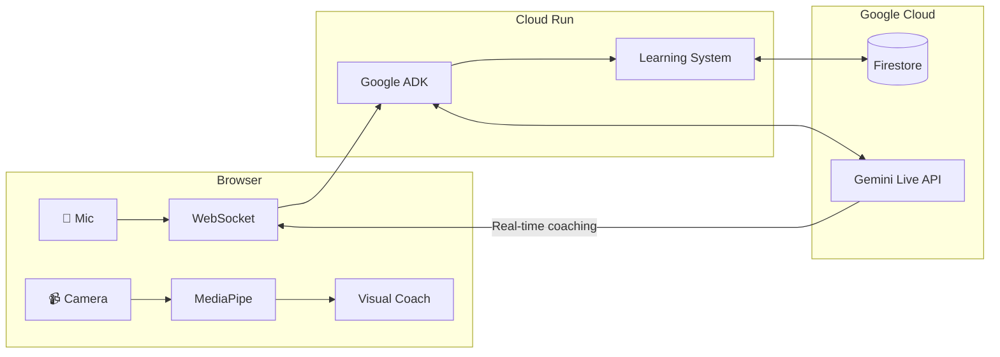

# Secondus

**Real-Time Negotiation Intelligence Agent**

> Your trusted second in high-stakes deals — like the advisor who stands behind you in a duel, knowing your strategy and protecting your interests.

[]()
[]()
[]()
[]()

## The Problem

In high-stakes negotiations, you're on your own. Legal review happens before and after — never during the moment that matters. Skilled counterparties use tactics like anchoring, artificial urgency, and nibbling to extract concessions you didn't intend to make. By the time you realize what happened, the deal is signed.

## The Solution

Secondus is a **real-time negotiation intelligence agent** that breaks the "text box" paradigm:

| Capability | What It Does |
|------------|--------------|
| **Real-Time Coaching** | Tells you exactly what to say with "SAY THIS:" phrases |
| **Tactic Detection** | Spots manipulation tactics and provides instant counters |
| **Visual Coaching** | Uses MediaPipe to analyze your body language in real-time |
| **Learning System** | Tracks your patterns and provides research-backed advice |
| **Barge-In** | Interrupts conversation at critical moments — no prompt needed |

## Architecture



## Key Features

### 1. Practice Mode with AI Adversary

Practice against a tough AI negotiator that uses real tactics:

- **ANCHORING** — Low first offers
- **NIBBLING** — Asks for extras after agreement
- **FLINCHING** — Price shock reactions
- **LIMITED AUTHORITY** — "Need to check with my boss"
- **URGENCY** — Artificial deadlines

### 2. Visual Intelligence (MediaPipe)

Real-time body language coaching:

| Detection | What We Track | Coaching |
|-----------|---------------|----------|
| **Face Mesh** | Eye contact, facial tension | "Maintain eye contact" |
| **Pose** | Lean, shoulder posture | "Lean in to show engagement" |
| **Hands** | Steepling, open palms | "Open palms signal honesty" |

### 3. Personalized Learning System

Tracks your patterns across sessions:

- **Weaknesses**: Stalling tolerance, gave equity, payment terms
- **Strengths**: Held price, closed deal, strong presence
- **Recommendations**: Research-backed advice from Harvard PON, Chris Voss, Joe Navarro

### 4. Cost Control

Built-in protections for API costs:

- 5-minute session timeout
- Low-cost text-only mode option
- Real-time cost tracking display
- Budget alert integration

## Tech Stack

| Component | Technology |
|-----------|------------|
| Model | `gemini-live-2.5-flash-native-audio` |
| Framework | Google ADK with `Runner.run_live()` |
| Backend | FastAPI on Cloud Run |
| Frontend | Vanilla HTML/JS + MediaPipe |
| Storage | Cloud Firestore |

## Quick Start

### Prerequisites

- Python 3.13+
- Google Cloud project with Vertex AI enabled
- `gcloud` CLI authenticated

### Local Development

```bash
# Clone and setup
cd backend
python -m venv venv
source venv/bin/activate
pip install -r requirements.txt

# Configure
export GOOGLE_CLOUD_PROJECT="your-project-id"
gcloud auth application-default login

# Run
python main.py
```

Open http://localhost:8080

### Deploy to Cloud Run

```bash
chmod +x deploy.sh
./deploy.sh
```

## Project Structure

```
secondus/
├── backend/
│   ├── main.py           # FastAPI + ADK bidi-streaming server
│   ├── agent.py          # Secondus agent definition
│   ├── learnings.py      # Pattern tracking & recommendations
│   ├── requirements.txt
│   └── tests/            # Test suite
├── frontend/
│   └── index.html        # Live session UI with MediaPipe
├── docs/
│   └── architecture.svg  # System architecture diagram
├── AGENTS.md             # Detailed architecture documentation
├── deploy.sh             # One-command Cloud Run deployment
└── README.md
```

## API Endpoints

| Endpoint | Method | Purpose |
|----------|--------|---------|
| `/health` | GET | Health check |
| `/ws/negotiate` | WebSocket | Live negotiation session |
| `/ws/practice` | WebSocket | Practice with AI adversary |
| `/learnings/briefing` | GET | Pre-session focus areas |
| `/learnings/analyze` | POST | Post-session analysis |

## Gemini Live Agent Challenge 2026

Built for the [Gemini Live Agent Challenge](https://geminiliveagentchallenge.devpost.com) hackathon.

### Challenge Requirements

| Requirement | Implementation |
|-------------|----------------|
| **Live Agent Category** | Real-time voice + vision processing |
| **Gemini Live API** | Native audio via ADK bidi-streaming |
| **Google Cloud** | Cloud Run, Firestore, Vertex AI |
| **Beyond Text Box** | Proactive barge-in, not reactive Q&A |

### Google Cloud Services

| Service | Purpose |
|---------|---------|
| **Vertex AI** | Gemini Live API access |
| **Cloud Run** | Serverless backend hosting |
| **Cloud Firestore** | Session state & learning persistence |
| **Cloud Billing** | Budget alerts & cost tracking |

### Key Differentiators

1. **Coach, Not Commentator** — Gives exact phrases to say, not observations
2. **Multimodal Analysis** — Audio + vision + document understanding
3. **Visual Intelligence** — Real-time body language feedback
4. **Personalized Learning** — Improves based on your patterns
5. **Research-Backed** — Uses proven negotiation frameworks

## Documentation

See [AGENTS.md](AGENTS.md) for detailed architecture documentation including:

- System architecture diagrams (Mermaid)
- Agent design and state machines
- Visual intelligence pipeline
- Learning system design
- API reference
- Cost management
- Deployment architecture

---

Built by [@mmoussaif](https://github.com/mmoussaif)

`#GeminiLiveAgentChallenge`
