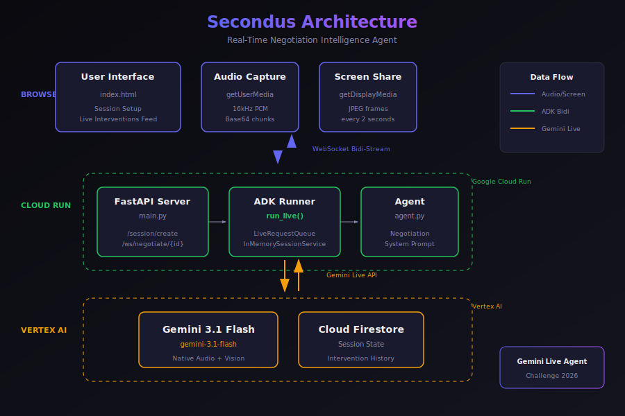

# Secondus

**Real-Time Negotiation Intelligence Agent**

> Your trusted second in high-stakes deals — like the advisor who stands behind you in a duel, knowing your strategy and protecting your interests.



## What it does

Secondus listens to your live deal conversation via microphone while watching your contract or term sheet on screen, then interrupts at the right moment with sharp tactical guidance:

- **Drift Detection** — Flags when spoken terms contradict the written document
- **Tactic Recognition** — Identifies manipulation tactics (anchoring, artificial urgency, nibbling) and suggests counters
- **Leverage Spotting** — Catches moments when the counterparty reveals flexibility

## Tech Stack

| Component | Technology |
|-----------|------------|
| Model | **Gemini 3.1 Flash** via Gemini Live API |
| Framework | **Google ADK** with bidi-streaming (`run_live()`) |
| Backend | **FastAPI** on **Cloud Run** |
| Frontend | Vanilla HTML/JS with WebSocket, WebRTC |
| Storage | **Cloud Firestore** for session state |

## Quick Start

### Prerequisites

- Python 3.13+
- Google Cloud project with Vertex AI enabled
- `gcloud` CLI authenticated

### Local Development

```bash
# Clone and setup
cd backend
python -m venv venv
source venv/bin/activate
pip install -r requirements.txt

# Configure
export GOOGLE_CLOUD_PROJECT="your-project-id"
gcloud auth application-default login

# Run
python main.py
```

Open http://localhost:8080

### Deploy to Cloud Run

```bash
chmod +x deploy.sh
./deploy.sh
```

## Project Structure

```
secondus/
├── backend/
│   ├── main.py          # FastAPI + ADK bidi-streaming server
│   ├── agent.py         # Secondus agent definition
│   └── requirements.txt
├── frontend/
│   └── index.html       # Live session UI
├── docs/
│   └── architecture.svg # System architecture diagram
├── deploy.sh            # One-command Cloud Run deployment
└── README.md
```

## How It Works

1. **Setup Phase** — User enters goals, BATNA, key terms, and counterparty info
2. **Live Session** — Browser captures mic audio (16kHz PCM) and screen (JPEG frames)
3. **ADK Processing** — `Runner.run_live()` streams data to Gemini 3.1 Flash
4. **Interventions** — Agent responds with urgency-coded alerts:
   - `URGENT` — Requires immediate attention (barge-in)
   - `WATCH` — Important tactical observation
   - `NOTE` — Detail to remember for later

## Gemini Live Agent Challenge 2026

Built for the [Gemini Live Agent Challenge](https://devpost.com) hackathon.

**Category:** Live Agent

**Google Cloud Services:**
- Vertex AI (Gemini 3.1 Flash)
- Cloud Run
- Cloud Firestore

---

Built by [@mmoussaif](https://github.com/mmoussaif)
