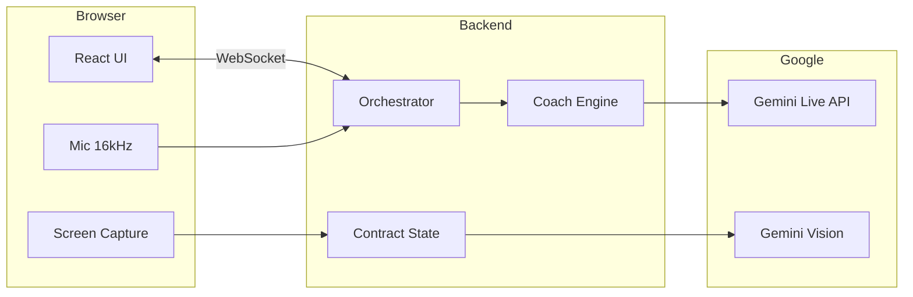

# Secondus

**Real-Time Negotiation Intelligence Agent**

> Your trusted second in high-stakes deals — like the advisor who stands behind you, knowing your strategy and protecting your interests.

[]()
[]()
[]()
[]()

## The Problem

In negotiations, you're on your own. Skilled counterparties use tactics like anchoring, artificial urgency, and nibbling to extract concessions. By the time you realize what happened, the deal is signed.

## The Solution

Secondus is a **real-time negotiation copilot** that:

| Capability | What It Does |
|------------|--------------|
| **Real-Time Coaching** | "Say this now" recommendations in context |
| **Contract Drift Detection** | Catches when spoken terms differ from written |
| **Tactic Detection** | Identifies anchoring, timeline pressure, etc. |
| **LLM-Powered Detection** | Semantic understanding of deal closure and circling |
| **Dynamic Scoring** | Fair evaluation with or without camera |

## Demo

```
┌─────────────────────────────────────────────────────────────┐
│  THEM: "We have a $50K budget and need this in 6 weeks."    │
│  ───────────────────────────────────────────────────────────│
│  ⚠️ ANCHORING PRESSURE                                      │
│  They set a low price anchor. Re-anchor on value.           │
│  ───────────────────────────────────────────────────────────│
│  💬 SAY THIS NOW                                             │
│  "Thanks for sharing. Our engagements typically start at    │
│   $80K to ensure comprehensive results."                    │
└─────────────────────────────────────────────────────────────┘
```

## Architecture



See [AGENTS.md](AGENTS.md) for detailed architecture documentation.

## Key Features

### 1. LLM-Powered Detection

The coaching engine returns structured signals:

```
CLOSING: YES/NO  - Is this a deal closure?
CIRCLING: YES/NO - Is conversation stuck?
SAY THIS: [phrase]
```

### 2. Contract Drift Detection

Visual + audio comparison:

```
📋 Contract says: $75,000, Net-30
🎤 They said: "$50K budget, Net-60"
⚠️ DRIFT: Payment terms conflict
```

### 3. Document Scanner

Manual capture and share flow:

1. **Start screen share** → Preview active
2. **Click "Start Analysis"** → Agent scans as you scroll
3. **Click "Done Scanning"** → Review extracted terms
4. **Click "Share"** → Send context to counterpart

### 4. Dynamic Scoring

| Camera State | Voice Weight | Presence Weight |
|--------------|--------------|-----------------|
| Disabled | 100% | 0% |
| Enabled | 70% | 30% |

No penalty for disabled camera.

## Tech Stack

| Component | Technology |
|-----------|------------|
| Frontend | React 18, TypeScript, Tailwind CSS v4, Vite |
| Backend | FastAPI, Python 3.13 |
| AI | Gemini Live 2.5 Flash, Gemini 2.0 Flash (Vision) |
| Deployment | Google Cloud Run |

## Quick Start

### Prerequisites

- Python 3.13+
- Node.js 20+
- Google Cloud project with Vertex AI enabled

### Local Development

```bash
# Backend (serves frontend from dist/)
cd backend
uv venv
source .venv/bin/activate
uv pip install -r requirements.txt
export GOOGLE_CLOUD_PROJECT="your-project-id"
python main.py
```

Open http://localhost:8080

For frontend development with hot reload:
```bash
cd frontend
npm install
npm run dev
# Visit http://localhost:5173 (proxies API to backend)
```

### Deploy to Cloud Run

```bash
./deploy.sh
```

## Project Structure

```
secondus/
├── backend/
│   ├── main.py                 # FastAPI server
│   ├── session_orchestrator.py # Session state machine
│   ├── coach_engine.py         # LLM coaching + detection
│   ├── contract_state.py       # Contract term management
│   ├── recap_engine.py         # Scoring and recap
│   ├── presence_engine.py      # Presence metrics
│   └── adversary.py            # AI counterparty
├── frontend/
│   ├── src/
│   │   ├── components/         # React components
│   │   ├── hooks/              # Custom hooks
│   │   └── types.ts            # TypeScript types
│   └── index.html
├── AGENTS.md                   # Architecture docs
├── CLAUDE.md                   # Development guidelines
├── tasks.md                    # Task tracker
└── deploy.sh                   # Cloud Run deployment
```

## WebSocket Protocol

### Client → Server

| Message | Purpose |
|---------|---------|
| `{ type: "start" }` | Begin negotiation |
| `{ type: "audio", data }` | Send audio chunk |
| `{ type: "screen", data }` | Send screen frame |
| `{ type: "share_contract" }` | Share terms with counterpart |
| `{ type: "end" }` | End session |

### Server → Client

| Message | Purpose |
|---------|---------|
| `transcript.append` | Chat message |
| `coach.recommendation` | Coaching phrase |
| `signal.alert` | Tactic/drift alert |
| `session.deal_closed` | Deal detected |
| `session.complete` | Session ended |

## Gemini Live Agent Challenge 2026

Built for the [Gemini Live Agent Challenge](https://geminiliveagentchallenge.devpost.com).

### Challenge Requirements Met

| Requirement | Implementation |
|-------------|----------------|
| Live Agent | Real-time voice + vision |
| Gemini Live API | Native audio via ADK |
| Google Cloud | Cloud Run deployment |
| Beyond Text Box | Proactive coaching, not Q&A |

### Key Differentiators

1. **Coach, Not Commentator** — Exact phrases to say
2. **Hybrid Detection** — LLM + deterministic signals
3. **Manual Document Control** — User-driven sharing
4. **Fair Scoring** — No camera penalty

## Author

Built by [@mmoussaif](https://github.com/mmoussaif)

[Google Developer Community](https://developers.google.com/community) member

`#GeminiLiveAgentChallenge`
